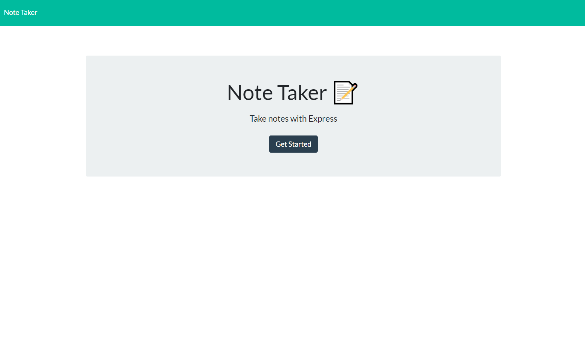

# Jot It Down
    

## Description

Jot It Down is a note taking app that allows you to write and store notes in your web browser.  This application uses JavaScript and Express.js.

## Table of Contents

- [Description](#description)
- [Installation](#installation)
- [Usage](#usage)
- [License](#license)
- [Contributing](#contributing)
- [Tests](#tests)
- [Questions](#questions)

## Installation

Run "npm install" to install the required packages. The app is deployed using Heroku.
https://frozen-mountain-40564.herokuapp.com/

## Usage

Once at the landing page, click `Getting Started.`  Enter a new note in the right hand column anf hit the `save` icon to save your note.  To add a new note hit the `+` symbol.

## License

This application is covered by the MIT license. 

For more information about this license please visit [https://choosealicense.com/licenses/mit/]

## Contributing

There were no collaborators on this project.

## Tests

No tests written.

## Questions

Find me on GitHub: [https://github.com/uncgirl02](https://github.com/uncgirl02)

Email me with any questions: ems1980@hotmail.com
    
